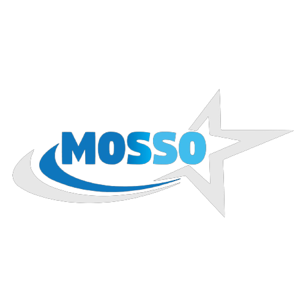

<div align="center">  

  # MOSSO Collections

  **Premium Sanitary Ware — Showcased Beautifully**

  A sleek, modern product showcase for MOSSO's high-end sanitary ware collections.  
  Browse curated product lines, filter by style, and experience a sophisticated shopping interface with full dark mode support.

  
  
  
  

</div>

---

## ✨ Features

| Feature | Description |
|---------|-------------|
| **Product Collections** | Browse 8 curated product series across 6 distinct styles — Modern, Classic, Minimalist, Avant-Garde, Natural & Industrial |
| **Product Overview** | Detailed product pages with image gallery, specifications & pricing |
| **Style Filtering** | Filter the entire catalog by design style to find exactly what you're looking for |
| **Quick View** | Preview product details without leaving the collections page |
| **Wishlist** | Save your favourite products for later with persistent local storage |
| **Shopping Cart** | Add products, adjust quantities and manage your cart — all client-side |
| **Dark / Light Mode** | Toggle between themes, with automatic detection of system preference |
| **Responsive Design** | Fully responsive layout with a dedicated mobile navigation menu |
| **Smooth Animations** | Fade-in sections, hero zoom effects and scroll-to-top navigation |
| **FAQ Page** | Common questions answered in an accordion-style layout |

---

## 🛠 Tech Stack

- **Framework** — React 19 with functional components & hooks
- **Language** — TypeScript
- **Build Tool** — Vite 6
- **Styling** — Tailwind CSS (CDN) with a custom design-token theme
- **Font** — [Manrope](https://fonts.google.com/specimen/Manrope) via Google Fonts
- **Icons** — Material Symbols Outlined
- **State** — React `useState` / `useEffect` + `localStorage` for persistence

---

## 📂 Project Structure

```
mosso/
├── public/               # Static assets (logo)
├── components/           # Reusable UI components
│   ├── Navbar.tsx        #   Header & navigation bar
│   ├── Footer.tsx        #   Site footer
│   ├── MobileMenu.tsx    #   Responsive mobile nav
│   ├── QuickViewModal.tsx#   Product quick-view overlay
│   ├── Pagination.tsx    #   Collection pagination
│   ├── Breadcrumbs.tsx   #   Page breadcrumb trail
│   ├── ThemeToggle.tsx   #   Dark / light mode switch
│   ├── ScrollToTopButton.tsx
│   └── AnimatedSection.tsx
├── pages/                # Full-page views
│   ├── HomePage.tsx
│   ├── CollectionsPage.tsx
│   ├── ProductOverviewPage.tsx
│   ├── WishlistPage.tsx
│   ├── CartPage.tsx
│   ├── FAQPage.tsx
│   └── Error404Page.tsx
├── hooks/                # Custom React hooks
│   ├── useCart.ts        #   Cart state management
│   └── useWishlist.ts    #   Wishlist state management
├── App.tsx               # Root component & client-side routing
├── constants.ts          # Product data & style definitions
├── types.ts              # Shared TypeScript types
├── index.html            # Entry HTML with Tailwind config
├── index.tsx             # React DOM mount point
├── vite.config.ts        # Vite configuration
└── package.json
```

---

## 🚀 Getting Started

### Prerequisites

- **Node.js** ≥ 18

### Installation

```bash
# Clone the repository
git clone https://github.com/your-username/mosso.git
cd mosso

# Install dependencies
npm install

# Start the dev server
npm run dev
```

The app will be available at **http://localhost:5173** (default Vite port).

### Build for Production

```bash
npm run build
npm run preview   # preview the production build locally
```

---

## 🎨 Design System

MOSSO uses a custom Tailwind theme built around a cohesive set of design tokens:

| Token | Light | Dark |
|-------|-------|------|
| Background | `#FFFFFF` | `#1A1A1A` |
| Secondary BG | `#F7F7F7` | `#222222` |
| Text | `#1A1A1A` | `#FFFFFF` |
| Secondary Text | `#666666` | `#A0A0A0` |
| Border | `#E0E0E0` | `#333333` |
| Primary | `#00AEF0` | — |

---

## 📸 Product Lines

| # | Collection | Style | Price |
|---|-----------|-------|-------|
| 1 | Aura Series | Modern | $185 |
| 2 | Metropolis Line | Classic | $240 |
| 3 | Zenith Collection | Minimalist | $195 |
| 4 | Terra Collection | Natural | $210 |
| 5 | Aqua Line | Avant-Garde | $280 |
| 6 | Etherea Series | Minimalist | $220 |
| 7 | Heritage Range | Classic | $260 |
| 8 | Forge Collection | Industrial | $200 |

---

## 📄 License

This project is proprietary. All rights reserved.

   `npm run dev`
